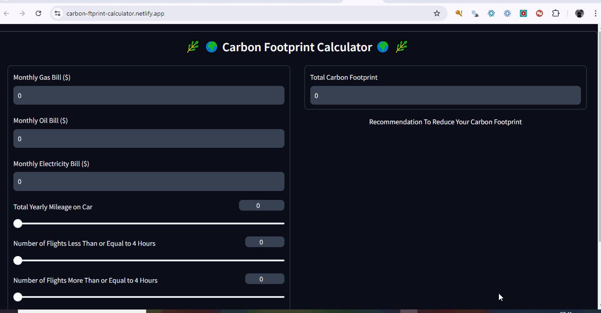

# Carbon Footprint Calculator




## Table of Contents

- [About the Project](#about-the-project)
- [Running Locally with Docker](#running-locally-with-docker)
- [Contributing](#contributing)

## About the Project

This project is a Carbon Footprint Calculator that helps users estimate their carbon footprint based on their monthly energy consumption and travel habits. It uses Google's Gemini API to provide personalized recommendations for reducing carbon emissions.

## Running Locally with Docker

To run this application locally using Docker, follow these steps:

1. **Build the Docker image:**

   ```bash
   docker build -t carbon-footprint-calculator .
   ```

2. **Run the Docker container:**

   ```bash
   docker run -p 7860:7860 carbon-footprint-calculator
   ```

3. **Access the application:**

   Open your web browser and navigate to `http://localhost:7860`.

## Contributing

Contributions are welcome! If you'd like to contribute to this project, please follow these steps:

1. **Fork the repository.**
2. **Create a new branch for your feature or bug fix.**
3. **Make your changes and commit them with descriptive messages.**
4. **Push your changes to your fork.**
5. **Create a pull request to the main repository.**

Please make sure to update the documentation as well if you make any changes to the application.
